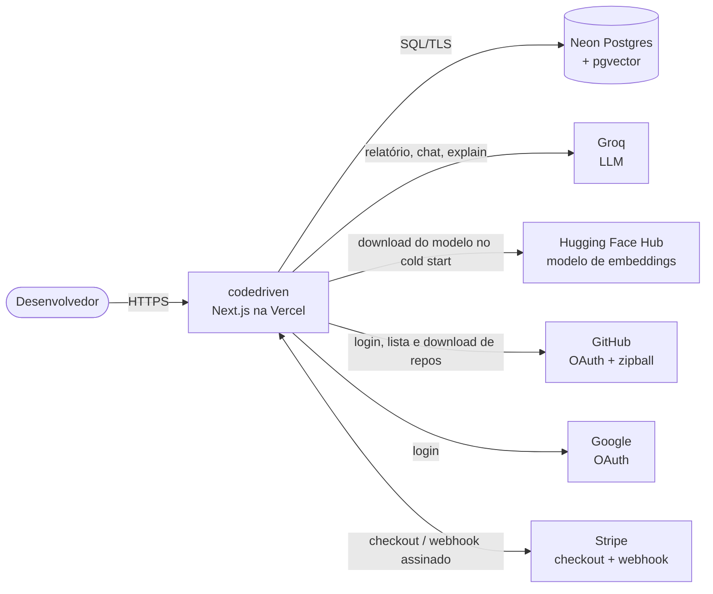
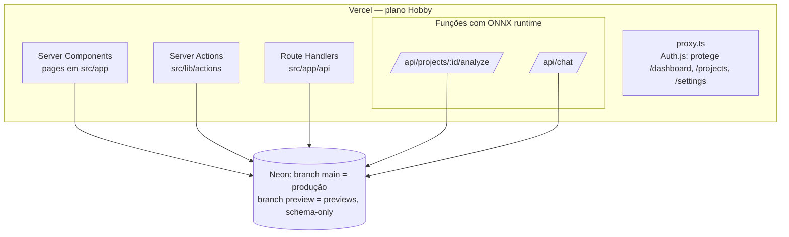

# Arquitetura atual (baseline)

Retrato de **como o sistema é hoje** (fim da Fase 2 do
[roadmap-v2.md](roadmap-v2.md)), não de como deveria ser. É o "antes" da
Fase 3 (monólito modular + Clean Architecture). Medições em
[baseline.md](baseline.md); dívidas em [technical-debt.md](technical-debt.md).

## C4 — nível 1: contexto

## C4 — nível 2: contêineres

- **Um único app Next.js 16** (App Router): pages, server actions e route
  handlers no mesmo deploy. Não há serviço separado nem fila.
- **Limite do plano Hobby:** no máximo 12 funções por deploy. O runtime ONNX
  (46 MB) só vai para `analyze` e `chat` via `outputFileTracingIncludes`;
  qualquer embedding precisa passar por essas duas rotas (TD-05).
- **Ambientes:** Production usa o branch `main` do Neon; Preview usa o
  branch `preview` (só schema) e segredos próprios (TD-36).

## Organização do código

| Pasta | Conteúdo | Linhas (sem testes) |
|---|---|---|
| `src/app/` | pages, layouts, route handlers | 3.014 (30 arquivos) |
| `src/components/` | UI por feature + `shared/` + `ui/` (shadcn, 998 linhas) | 4.235 (46 arquivos) |
| `src/lib/` | regras de negócio, acesso a dados, integrações | 4.871 (41 arquivos) |
| `src/db/schema.ts` | schema Drizzle (10 tabelas) | 248 |

Total: 121 arquivos de produção e 23 de teste (medido em 2026-09-29).

`src/lib/` mistura regra de negócio e infraestrutura por tipo técnico, não por
domínio: `actions/` (server actions), `analysis/` (pipeline, métricas,
relatório, RAG), `billing/`, `files/`, `ai/`, e módulos soltos (`auth.ts`,
`db.ts`, `github.ts`, `encryption.ts`, `rate-limit.ts`).

## Mapa de acoplamento

Quem importa cada dependência de infraestrutura **diretamente**:

| Dependência | Arquivos | Destaque |
|---|---|---|
| Drizzle client (`@/lib/db`) | 27 | **12 em `src/app`**: 6 pages e 6 route handlers consultam o banco direto |
| Schema (`@/db/schema`) | 30 | inclusive um componente (`project-status-badge.tsx`, via `import type`, sem acoplamento em runtime) |
| `auth()` | 27 | cada page, action e rota checa a sessão por conta própria |
| GitHub API (`@/lib/github`) | 6 | incluindo a page `projects/new` e o componente `repo-picker` |
| LLM (`@/lib/ai/llm`) | 3 | chat, explain e relatório; sem interface, Groq direto (ou o fake do E2E) |
| Embeddings | 2 | `vector-store` e `chat-rag` |
| Stripe | 4 | webhook, actions de billing e sincronização |

Consequências que a Fase 3 ataca:

- Não há camada entre a entrega (pages/rotas) e o banco: a regra de
  "projeto do usuário" (`eq(projects.userId, …)`) se repete em dezenas de
  consultas. Os testes de IDOR (Fase 2) protegem, mas não evitam a repetição.
- Trocar LLM, embeddings ou origem do código exige mexer em quem chama; não
  há porta (`LlmProvider`, `Embedder`, `SourceProvider`).
- O estado do projeto (`queued → processing → completed/failed`) muda em
  vários lugares (rota `analyze`, actions, pipeline) sem um dono único.

## Fluxos principais

### Importação (GitHub ou ZIP)

1. Server action (`lib/actions/github.ts`) checa sessão, rate limit e limites
   do plano **dentro de uma transação com lock** na linha do usuário.
2. Cria o projeto, registra o uso da cota.
3. Baixa o zipball do GitHub (token cifrado com AES-256-GCM) ou lê o upload.
4. `extractFromZipBuffer`: zip-slip, symlinks, zip bomb, limites, arquivos
   sensíveis e `.gitignore` do repositório analisado.
5. Grava os arquivos em `project_files` (Postgres) e deixa o projeto `queued`.

Tudo **dentro da request** (sem job em segundo plano — TD-10).

### Análise

1. A página de progresso chama `POST /api/projects/:id/analyze`.
2. A rota faz o "claim" atômico do projeto (evita duas análises simultâneas)
   e roda `runFullProjectAnalysis` **na própria request** (`maxDuration` 300 s).
3. Pipeline: chunking com Tree-sitter → embeddings locais (MiniLM q8, ONNX) →
   `code_chunks` (pgvector) → métricas determinísticas + LLM (Groq,
   `generateObject`) → `reports`.
4. O cliente acompanha por polling em `/api/projects/:id/status`.

### Chat (RAG)

`POST /api/chat`: sessão → zod → projeto do usuário → rate limit → embedding
da pergunta → busca vetorial (top 8, escopo por usuário) → `streamText` com
o contexto → resposta em streaming com as fontes.

### Billing

Checkout do Stripe (server action) → retorno em Settings sincroniza a sessão
pelo servidor → **webhook assinado** (`/api/stripe/webhook`) mantém o plano
em dia (cancelamento, falha de pagamento). Eventos de assinatura buscam o
estado atual no Stripe (idempotente, sem tabela de eventos).

## Segurança (resumo)

- Sessão checada no servidor em toda page, action e rota; toda consulta de
  dados do usuário filtra por `userId` (testado contra Postgres real).
- Tokens do GitHub cifrados (AES-256-GCM, AAD = id do dono); estado OAuth
  assinado e com expiração.
- Rate limit em Postgres (login, registro, chat, análise, billing).
- Erros genéricos para o cliente; código privado servido com `no-store`.
- TLS para o banco (ver TD-38); previews isolados de produção (TD-36).

## Qualidade e entrega

- **CI (obrigatório para merge):** lint, typecheck, migrations em sincronia
  com o schema, 156 testes unitários, build; 10 testes de integração em
  Postgres descartável; E2E do fluxo completo na build de produção; varredura
  OSV de dependências.
- **Deploy:** Vercel, a cada merge na `main`; preview por PR.
