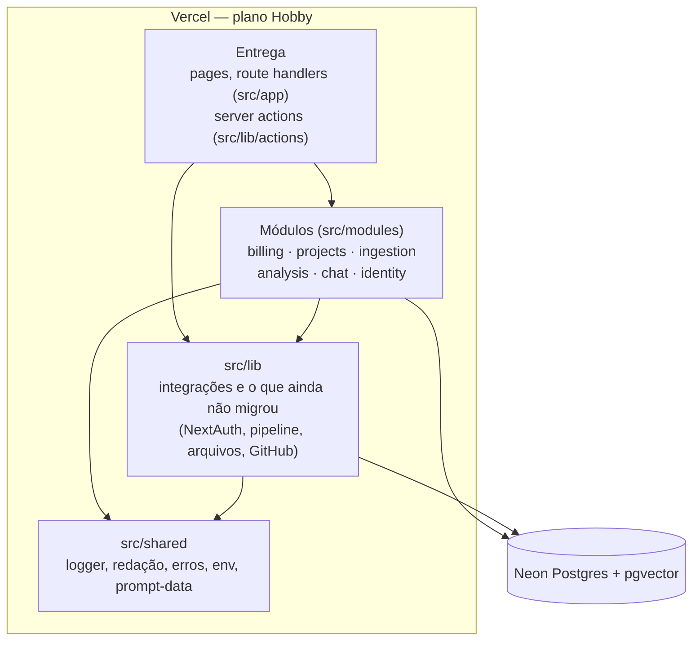

# Arquitetura atual

Retrato de **como o sistema é hoje** (fim da Fase 3 do
[roadmap-v2.md](roadmap-v2.md)): um monólito modular com Clean Architecture
e DDD aplicados só onde há regra de negócio ([ADR-001](decisions/001-modular-monolith.md)).
O "antes" está em [architecture-baseline.md](architecture-baseline.md); a
comparação medida, em [results-phase-3.md](results-phase-3.md). Convenções
dos módulos em [modules.md](modules.md); linguagem em [glossary.md](glossary.md).

## C4 — nível 1: contexto

Igual ao baseline: o app (Next.js na Vercel) fala com Neon Postgres +
pgvector, Groq (LLM), Hugging Face Hub (modelo de embeddings no cold start),
GitHub (OAuth e zipball), Google (OAuth) e Stripe (checkout e webhook
assinado).

## C4 — nível 2: contêineres e camadas

- **A entrega não toca o banco:** nenhum arquivo de `src/app` importa o
  cliente do Drizzle nem o schema (era 12). Pages e rotas chamam as APIs
  públicas dos módulos.
- **Mesmo deploy, mesmos limites:** um app Next.js 16, no máximo 12 funções
  (Hobby); o runtime ONNX só em `analyze` e `chat`. Sem fila (Fase 5).

## Módulos

Cada módulo expõe `index.ts` (puro: tipos e regras, importável até por
componentes de cliente) e `server.ts` (`server-only`: tudo que usa banco,
rede ou modelo). O interior (`domain/`, `application/`, `infrastructure/`)
é privado.

| Módulo | Domínio (puro) | Application / portas | Infraestrutura |
|---|---|---|---|
| **billing** | planos, limites, cota (dia UTC, carência do `past_due`), `entitlementFor` | `createQuota` + porta `BillingRepository` | repositório Drizzle, `withQuota` (lock + checagem + uso numa transação), Stripe atrás de uma camada anticorrupção (`translate.ts`) |
| **projects** | ciclo de vida (`analysisStart`, `ACTIVE_STATUSES`, `STALE_AFTER_SECONDS`), link público (`isShareActive`, `redactForPublic`) | — | todas as escritas de status num arquivo, queries das pages, importação (`importArchive`), links públicos (só o hash do token) |
| **ingestion** | `EMBEDDING_DIMENSIONS` (fonte única), `ChunkDraft` | `storeKnowledge` + portas `Embedder` e `VectorStore` | ONNX (MiniLM q8, revisão fixada), pgvector |
| **analysis** | `Finding` (com evidência opcional), uma `Rule` por heurística, `ScoringPolicy` (`linearPenaltyPolicy`) | — | a geração do relatório ainda está em `src/lib/analysis/report.ts` |
| **chat** | política do prompt (código como dado), extração da pergunta | — | busca de contexto via ingestion |
| **identity** | — (dados e integração) | — | conta, conexão com o GitHub (páginas só recebem um booleano), cadastro, credenciais, o que cada login registra |

**Portas** só onde há duas implementações ou um teste precisa de fake:
`Embedder`, `VectorStore` e `BillingRepository`. `LlmProvider` nasce com o
Ollama (v2.2); `AnalysisRunner`, com a fila (Fase 5).

## Regras verificadas no CI (`npm run lint:arch`)

`dependency-cruiser`, bloqueando o merge; **baseline de violações: 0**.

- `domain/` não importa application, infrastructure, `src/lib`, `src/db`
  nem frameworks.
- `application/` não importa infrastructure nem Drizzle/Stripe/Next.
- Fora de um módulo, só `index.ts` e `server.ts`.
- `index.ts` não importa banco nem `server-only`.
- Sem React dentro de módulos; sem ciclos; produção não importa testes.
- `src/app` e `src/components` não importam o banco (imports de tipo são
  permitidos).

## Fluxos principais

### Importação (GitHub ou ZIP)

Server action (sessão, zod, duplicado) → download do GitHub fora da cota →
`importArchive` (projects): `withQuota` do billing cria o projeto e registra
o uso numa transação → extração segura → arquivos gravados → projeto
`queued`. Arquivo inválido é erro do usuário e continua cobrado; falha nossa
devolve a análise (ADR-003, TD-12).

### Análise

Página de progresso (`useAnalysisProgress`) → `POST /api/projects/:id/analyze`
→ `analysisStart` decide e `claimAnalysis` faz o claim atômico (projects) →
pipeline: chunking (Tree-sitter) → `storeKnowledge` (ingestion) → métricas
e regras (analysis) → revisão do LLM com o código em blocos de dados
(TD-28) → `verifyEvidence` (achado do LLM só fica com trecho que existe no
arquivo citado) → `groupFindings` + `diminishingPenaltyPolicy` (ADR-010) →
`reports`. Tudo dentro da request
(`maxDuration` 300 s) até a Fase 5.

### Chat (RAG)

`POST /api/chat`: sessão → zod → `getChatProject` (projects: dono +
knowledge) → rate limit → `retrieveChatContext` (chat → ingestion, escopo
por dono) → prompt com as fontes em blocos de dados → `streamText` → fontes
no fim do stream.

### Link público do relatório

O dono gera um link (7 dias, 30 dias ou sem expiração, revogável) → só o
SHA-256 do token vai para o banco → `/r/<token>` (fora do login, rate limit
por IP, `noindex`, `no-referrer`) mostra só o relatório, com segredos
redigidos.

### Billing

Checkout, portal e webhook passam pelo módulo; o webhook verifica a
assinatura e busca o estado atual da assinatura no Stripe (idempotente).

## Segurança (resumo)

- Sessão checada no servidor em toda page, action e rota; toda consulta de
  dados do usuário filtra por `userId`, com testes de IDOR em Postgres real
  (projetos, arquivos, chunks, relatório, links públicos, conexão com o
  GitHub).
- Tokens do GitHub cifrados (AES-256-GCM, vinculados ao dono); páginas só
  recebem um booleano.
- Senhas só como hash bcrypt; senha não verificada descartada quando um
  provedor OAuth prova o e-mail; tempo de login igual para e-mail
  inexistente.
- Código do repositório tratado como dado nos prompts (delimitador
  aleatório por requisição).
- Rate limit em Postgres; erros genéricos para o cliente; código privado
  com `no-store`.

## O que ainda não está nos módulos

| Onde | O que é | Quando |
|---|---|---|
| `src/lib/analysis/report.ts`, `report-llm.ts`, `pipeline.ts` | geração do relatório e orquestração da análise | com o `LlmReviewer` (Fase 7) e o `AnalysisRunner` (Fase 5) |
| `src/lib/files/*`, `chunking.ts` | extração, armazenamento de arquivos, chunking (Tree-sitter) | quando o pipeline migrar |
| `src/lib/rate-limit.ts` | limitador em Postgres (tabela `rate_limits`); o plano vem do billing | infraestrutura compartilhada |
| `src/lib/auth.ts` | configuração do NextAuth (adapter do Drizzle) | integração, fica |

Arquivos de produção com acesso ao banco ou ao Drizzle: 17 (eram 27), 11
deles dentro dos módulos ([results-phase-3.md](results-phase-3.md)).

## Qualidade e entrega

- **CI (obrigatório para merge):** `lint:arch`, lint, typecheck, migrations
  em sincronia com o schema, testes unitários e de componente, build;
  integração em Postgres descartável; E2E do fluxo completo (inclusive o
  link público) na build de produção; OSV.
- **Deploy:** Vercel a cada merge na `main`; preview por PR com banco e
  segredos próprios.
